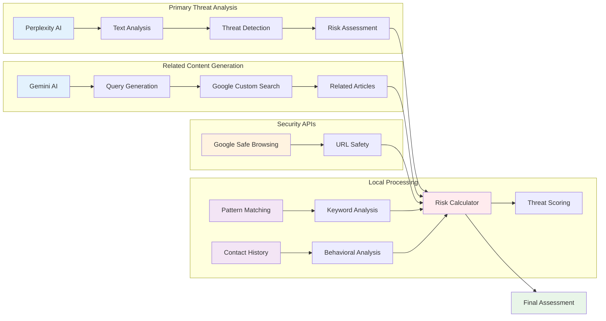

# AI Components

## Overview

ThreatSense leverages multiple AI technologies to provide comprehensive threat detection and analysis.

## Diagram

## AI Technology Stack

### Primary Threat Analysis
- **Perplexity AI**: Main threat analysis engine
  - Analyzes text for phishing indicators, social engineering, malware patterns
  - Provides threat level, detailed summary, and actionable recommendations
  - Uses advanced cybersecurity guidelines and real-time threat intelligence
  - Returns structured JSON with threat assessment

### Related Content Generation
- **Gemini AI**: Query generation for related content
  - Creates search queries from threat analysis results
  - Generates contextual search terms for finding similar threats
  - Uses Google's Gemini 1.5 Flash model for natural language processing
- **Google Custom Search**: Finds relevant articles and news about similar threats

### Security APIs
- **Google Safe Browsing**: URL reputation and safety checking

### Local Processing
- **Pattern Matching**: Rule-based threat pattern detection
- **Keyword Analysis**: Suspicious keyword and phrase identification
- **Contact History**: Behavioral analysis of sender patterns
- **Risk Calculator**: Multi-factor threat scoring algorithm

### Integration Points
- **Data Fusion**: Combines all analysis results
- **Weighted Scoring**: Applies different weights to different factors
- **Context Awareness**: Considers user context and history
- **Real-time Updates**: Continuous learning and adaptation 