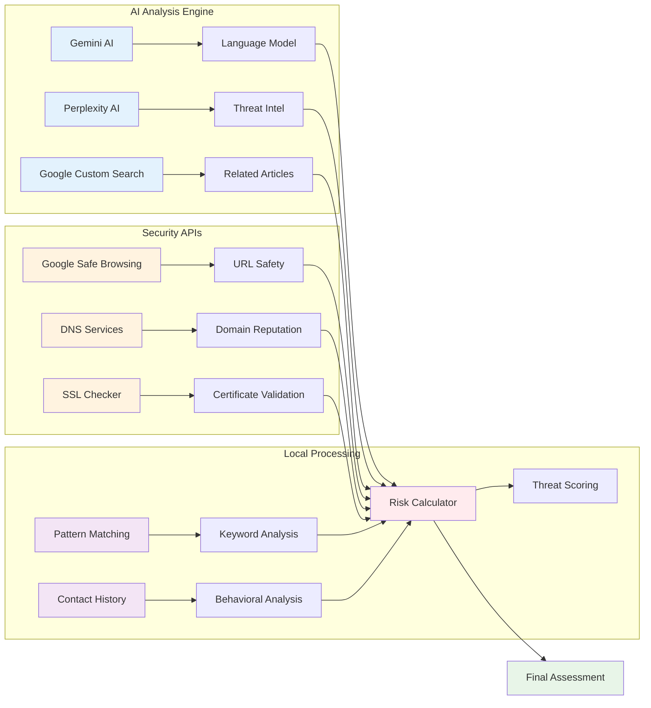

# AI Components

## Overview

ThreatSense leverages multiple AI technologies to provide comprehensive threat detection and analysis.

## Diagram

## AI Technology Stack

### Core AI Engines
- **Gemini AI**: Google's advanced language model for text analysis
- **Perplexity AI**: Real-time threat intelligence and research
- **Google Custom Search**: Contextual article and news retrieval

### Security APIs
- **Google Safe Browsing**: URL reputation and safety checking
- **DNS Services**: Domain reputation and blacklist checking
- **SSL Checker**: Certificate validation and encryption verification

### Local Processing
- **Pattern Matching**: Rule-based threat pattern detection
- **Keyword Analysis**: Suspicious keyword and phrase identification
- **Contact History**: Behavioral analysis of sender patterns
- **Risk Calculator**: Multi-factor threat scoring algorithm

### Integration Points
- **Data Fusion**: Combines all analysis results
- **Weighted Scoring**: Applies different weights to different factors
- **Context Awareness**: Considers user context and history
- **Real-time Updates**: Continuous learning and adaptation 