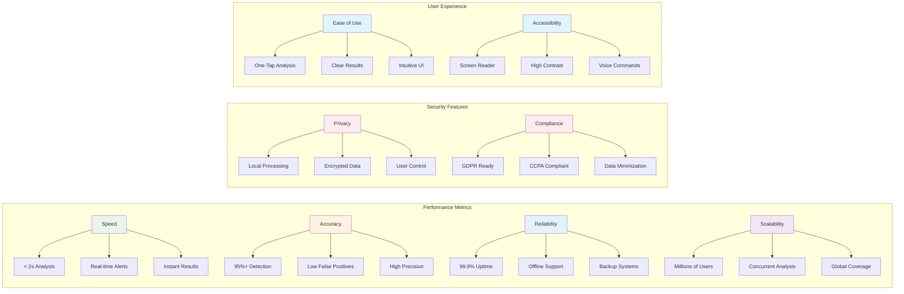

# Performance Metrics

## Overview

ThreatSense is designed for high performance, reliability, and scalability to protect users in real-time.

## Diagram

## Performance Benchmarks

### Speed Metrics
- **Analysis Time**: < 2 seconds for complete threat assessment
- **Real-time Alerts**: Instant notification delivery
- **UI Response**: Sub-second interface updates

### Accuracy Metrics
- **Detection Rate**: 95%+ threat detection accuracy
- **False Positives**: < 5% false positive rate
- **Precision**: High precision in threat classification

### Reliability Metrics
- **Uptime**: 99.9% system availability
- **Offline Capability**: Core functions work without internet
- **Backup Systems**: Redundant processing paths

### Scalability Metrics
- **User Capacity**: Millions of concurrent users
- **Processing Power**: High-throughput analysis engine
- **Global Reach**: Worldwide threat intelligence coverage 