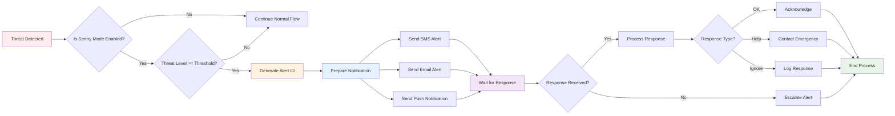

# Sentry Mode Emergency Flow

## Overview

Sentry Mode is ThreatSense's emergency notification system that automatically alerts trusted contacts when threats are detected above a specified threshold.

## Diagram

## Flow Explanation

### 1. Threat Detection
- **Trigger**: High-threat content detected by AI analysis
- **Threshold Check**: Compares threat level against user-configured threshold
- **Mode Verification**: Ensures Sentry Mode is enabled

### 2. Alert Generation
- **Alert ID**: Unique identifier for tracking the incident
- **Multi-Channel**: Simultaneous notifications via SMS, email, and push
- **Contact Selection**: Targets pre-configured trusted contacts

### 3. Response Handling
- **Timeout**: Waits for contact response within configured timeframe
- **Escalation**: Automatic escalation if no response received
- **Response Processing**: Handles different types of contact responses

### 4. Response Types
- **OK**: Contact acknowledges and confirms safety
- **Help**: Contact requests emergency assistance
- **Ignore**: Contact dismisses the alert

### 5. Process Completion
- **Logging**: All actions and responses are logged
- **Cleanup**: Alert resources are released
- **Recovery**: System returns to normal monitoring state 