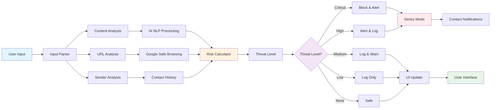

# System Architecture

## Overview

This diagram shows the complete system architecture of ThreatSense, including data flow, component interactions, and the processing pipeline from user input to threat assessment.

## Diagram

## Component Details

### Input Processing
- **User Input**: Text messages, URLs, or content from various sources
- **Input Parser**: Validates and normalizes input data
- **Content Analysis**: Extracts key information and patterns
- **URL Analysis**: Checks links for safety and reputation
- **Sender Analysis**: Evaluates sender history and trustworthiness

### AI Processing
- **AI NLP Processing**: Uses Gemini AI for natural language understanding
- **Google Safe Browsing**: Validates URLs against Google's threat database
- **Contact History**: Analyzes previous interactions with the sender

### Risk Assessment
- **Risk Calculator**: Combines all analysis results into a threat score
- **Threat Level**: Determines the appropriate response level
- **Decision Logic**: Routes to appropriate handling based on threat level

### Response System
- **Sentry Mode**: Emergency notification system for high-threat situations
- **UI Updates**: Real-time interface updates for user awareness
- **Contact Notifications**: Automated alerts to trusted contacts
- **User Interface**: Clean, intuitive display of results and status 