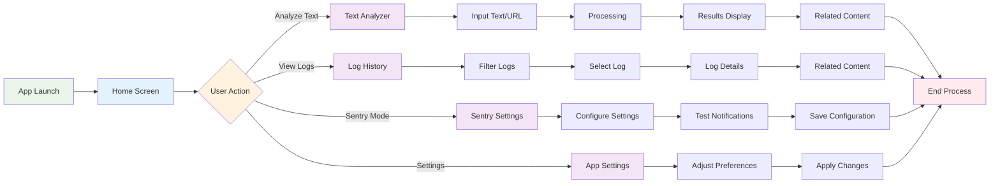

# User Interface Flow

## Overview

ThreatSense provides an intuitive, user-friendly interface designed for users of all technical levels.

## Diagram

## User Journey

### 1. App Launch
- **Splash Screen**: Branded loading experience
- **Home Screen**: Clean, intuitive main interface
- **Quick Actions**: Easy access to key features

### 2. Text Analysis Flow
- **Input Method**: Paste text or enter URL
- **Processing**: Real-time AI analysis
- **Results**: Clear threat assessment display
- **Related Content**: AI-generated articles and resources

### 3. Log Management
- **History View**: Chronological list of analyses
- **Filtering**: Search and filter capabilities
- **Detail View**: Comprehensive analysis results
- **Related Content**: Contextual information and resources

### 4. Sentry Mode Configuration
- **Settings Panel**: Easy configuration interface
- **Contact Management**: Add and manage trusted contacts
- **Threshold Setting**: Adjust sensitivity levels
- **Testing**: Verify notification system works

### 5. App Settings
- **Preferences**: Customize app behavior
- **Privacy Settings**: Control data sharing
- **Accessibility**: Adjust for different needs
- **Notifications**: Configure alert preferences 